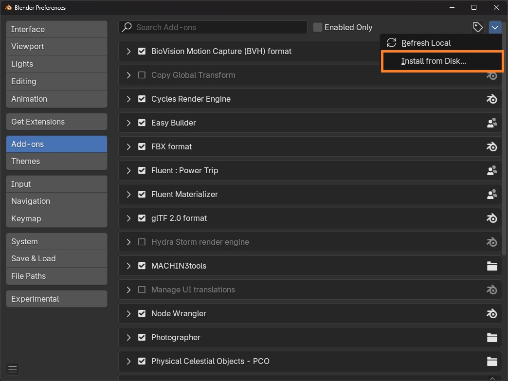
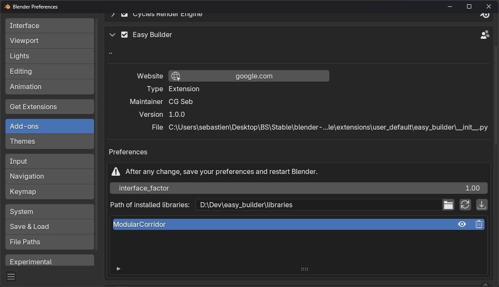

# 2. Installation

There is no specific installation process, you can install it like any other Blender addon/extension.

<figure markdown>
  { width="600" } 
  <figcaption>Drag and drop the zip</figcaption>
</figure>

You can drag and drop the addon Zip file named **addon_easy_builder_x.x.x.zip** (where x.x.x is the latest version of the addon) in blender and click on OK.

<figure markdown>
  { width="600" } 
  <figcaption>Install from preferences</figcaption>
</figure>

The second way to install is to go in the preferences, add-ons tab, click on the arrow in the top right corner, "Install from disk" and select the addon Zip file named **addon_easy_builder_x.x.x.zip** (where x.x.x is the latest version of the addon).

<figure markdown>
  { width="600" } 
  <figcaption>Easy Builder preferences</figcaption>
</figure>

!!! info
    You can change where the asset packs are installed, in the addon preferences -> "Path of installed libraries".

After the addon is installed, click on the import button { width="20" }.
In the popup, select the Zip file named **modular_scifi_corridor_x.x.x.zip** (where x.x.x is the latest version of the addon).
Repeat the operation for the city and medieval house asset pack.

!!! info
    If the asset packs are not showing, click on the refresh button { width="20" } at the top of the preferences.

!!! warning
    After any change, save the preferences and restart Blender to prevent any issues.