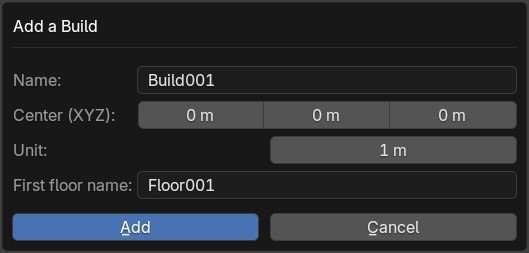

# 3. Builds and Floors

The first aspect to know about Easy Build is that it works in builds and floors.

To start anything you need to create a build.

A build is a set of Floors where the assets will be placed. You can say it's a "building", but as you probably saw it is also used for cities and every modular asset.

- Name the build and the first floor
- The center of the build will define where to place the center of the grid that will guide you in the asset placement.
- The Unit will define the default grid resolution (can be changed during editing later)

All the builds and floors will appear as a list in the NPanel. Only the floors of the selected build are shown in the floor list.

## Actions
On top of the build list there are two buttons, the first one { width="20" } is to edit the selected Build and floor, the second one { width="20" }, is to create a new build.

The { width="20" } button on the floor list is to create a new floor.

In both lists, there are multiple buttons:

- { width="20" }: To move a build or a floor.
- { width="20" }: To duplicate a floor, it will copy all the floor, wall and ceiling objects.
- { width="20" }: To delete a build or a floor.
- { width="20" }: To hide/show a build or a floor.

