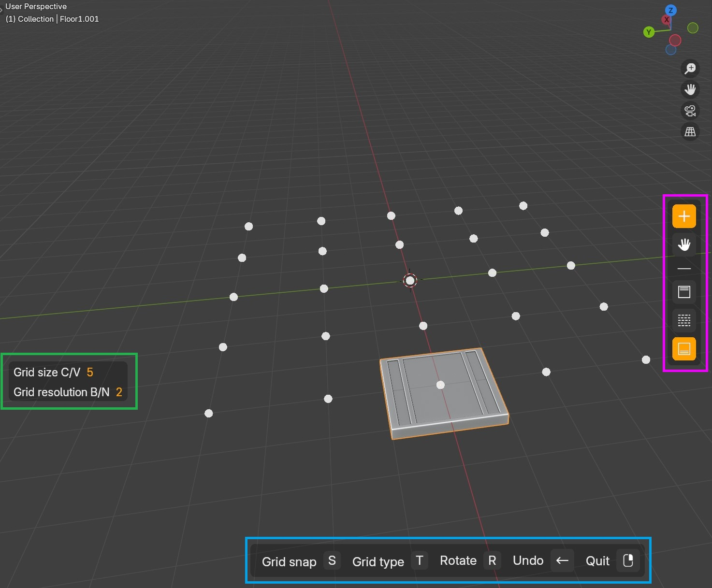
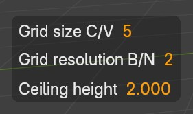

# 4. Add assets

When creating a build, it will create a floor too. It will then switch automatically indo floor edit mode.

A new interface then appear with multiple sections.

<figure markdown>
  { width="500" } 
  <figcaption>Add mode</figcaption>
</figure>

## Text info on the left
Framed in green on the previous screenshot, the left text provides you information about the grid settings.

The "C/V" and "B/N" are the shortcuts to change those settings (example: V will increase the Grid size and C will decrease it).

## The shortcut bar at the bottom
At the bottom (framed in blue), there are all the available shortcuts for the selected mode and tool.

## The action bar on the right
Framed in pink, on the right there are buttons to switch between the Add and Move tool and also three other buttons to work on the floor, wall or ceiling.

## Ceiling
When adding a ceiling for the first time, it will ask you if you want to set the height with a predefined value (height in meters from the floor) or manually by moving the mouse up and down.

!!! info
    If you choose the "Value" mode, by default, Easy Builder will detect automatically the height of the walls you put and set the height of the ceiling on top of the walls. 
    If you didn't put any wall it will take two times the build unit (set when you created the build).

### Value mode
Like explained before, it will have by default the height of the walls or the two times the unit, but you can set a value.

<figure markdown>
  { width="350" } 
  <figcaption>Ceiling height</figcaption>
</figure>

On the left you can see the "Ceiling height", press Backspace to erase and type the height you want, once done press enter to validate.

!!! info
    The height is relative from the floor, not the world origin.

!!! info
    In **value mode**, you can rotate the view by **holding SHIFT** and use 1, 3 or 5 on the NumPad.

### Manual mode
In manual mode, the floor height is following the mouse up and down. To adjust slower, hold SHIFT and to adjust faster hold CTRL. Left click to validate the height.

!!! info
    In **manual mode**, to rotate the view, you can use the NumPad as usual, **without holding SHIFT like in Value mode**.