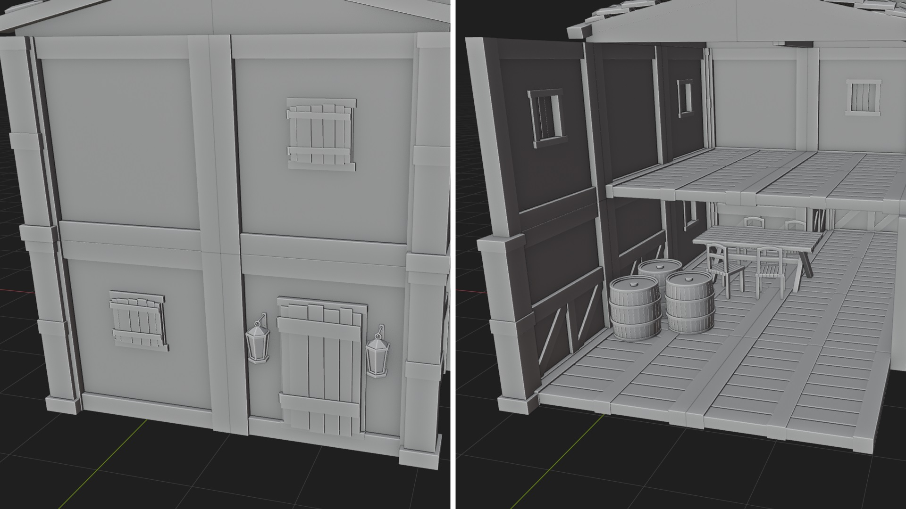

# 7. XRay mode

The Xray mode only works when you are in Add or move mode. The xray mode allows you to see through the walls and ceilings to help you place assets inside rooms.

<figure markdown>
  { width="400" } 
  <figcaption>XRay off (left) on (right)</figcaption>
</figure>

The XRay is hiding all the assets in front of you before a certain distance. You can change the distance when the XRay is on.

The XRay will hide assets like this:

- Hide all the floors, walls and ceilings of the floors above the one selected in the Npanel.
- Hide the walls and ceilings of the selected floor if you are in floor mode
- Hide only the ceilings of the selected floor if you are in wall mode