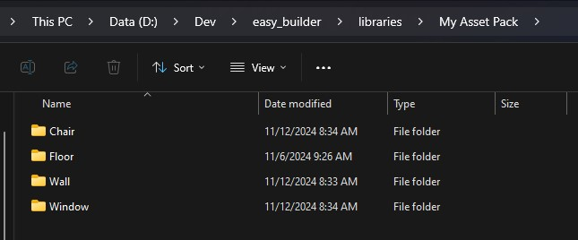

# 8. Create asset packs

There are 2 asset packs included with Easy Builder, but you can create your own and use it with the addon.

## File structure
To be able to work with the addon, you will need to follow a file structure. The first step is to check where your libraries are located.

Go to the preferences of the addon and look where the libraries are installed.

<figure markdown>
  { width="800" } 
  <figcaption>Library path</figcaption>
</figure>

Inside the folder where your libraries are located, create a new folder with the name of you asset pack (here I choose "My Asset Pack").

<figure markdown>
  { width="800" } 
  <figcaption>Library folder</figcaption>
</figure>

Inside this folder, you need to create one folder for each asset with the name of the asset.

<figure markdown>
  { width="800" } 
  <figcaption>Assets folders</figcaption>
</figure>

And to conclude on the structure, inside this folder, you need a Blender file named **asset.blend** with only your asset inside and a **preview.png** (256x256px image of your asset).

<figure markdown>
  { width="800" } 
  <figcaption>Asset files</figcaption>
</figure>

!!! warning
    The object inside the blend file has to have the same name as the folder it is in.

## Origin of the objects

Because Easy Builder is using a grid system, your assets have to fit inside the unit system.

There are no limitation of size for your assets, but they must fit in the unit (1m, 2m, 3m, ...). You can go also with half a unit (0.5m).

<figure markdown>
  { width="800" } 
  <figcaption>Asset fit</figcaption>
</figure>

On this image we can see that all the assets are fitting because the distance between the origins fits the unit system.

!!! info
    Notice that the origins don't have to be in the center of the assets, only the distance between 2 origins have to fit in the unit system.

!!! info
    If you still can't make it work, please ask on the <a href="https://discord.gg/7B5wT8bQBD" class"center" target="_black">Discord server</a>, so we can have a look at your special case.